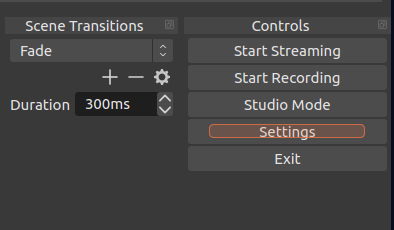
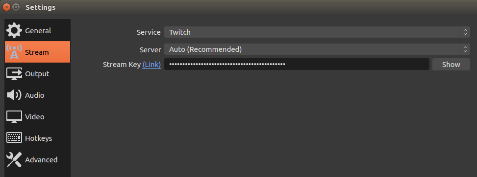
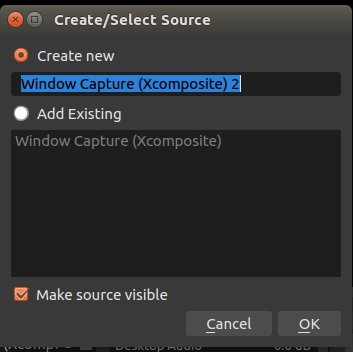
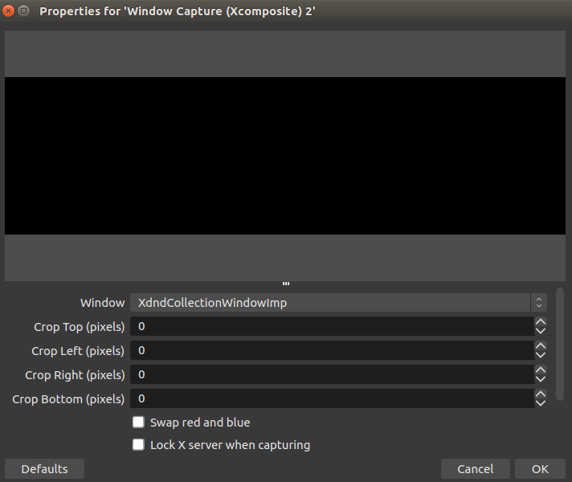

# teleop twist twitch

Author: Fasermaler


ROS Teleop package that works with the twitch chat API to receive commands from Twitch chat.

`teleop-twist-twitch` uses normal ROS geometry twist messages and is compatible with other robots. A simulation demo is included within this repository.

**Warning: The author is not responsible for any damage caused by rogue and unchecked robot tele-operation. Please take necessary precautions before deploying this to a physical robot.**

______

Chat Test and functionality is based off the [Chat Samples](https://github.com/twitchdev/chat-samples) from the twitchdev GitHub repo.

Teleop component is based off the [teleop twist keyboard](https://github.com/ros-teleop/teleop_twist_keyboard) package from the ros-teleop GitHub repo.

Rover demonstration is modified from [ThiruVenthan's article on medium](https://medium.com/teamarimac/integrating-sonar-and-ir-sensor-plugin-to-robot-model-in-gazebo-with-ros-656fd9452607).

## Pre-requisites

- Ubuntu 16.04 computer
- ROS Kinetic
- ROS Gazebo
- Twitch Account

If you require assistance with installing ROS Kinetic and ROS Gazebo, the instructions are provided in the last section.

## Setup

### Twitch 

Take note of the the `keywords` as there are multiple types of keys being used in the setup.

1. Login to [Twitch](https://www.twitch.tv/).

2. Go to the developer console to manage apps and [create a new app](https://dev.twitch.tv/console/apps/create)

   How to fill in:

   - Name: twitch-plays-teleop
   - OAuth URL: http://localhost
   - Category: Chat bot

3. Return to the [apps console](https://dev.twitch.tv/console/apps) and select the newly created app to view the client ID (copy it somewhere safe). This is called the `client ID`.

4. Go to the [Twitch Chat Auth Generator](https://twitchapps.com/tmi/) while logged into your Twitch account. 

5. Generate a key and copy it somewhere safe as well. This is called the `token`.

6. Go to the [Twitch stream settings](https://www.twitch.tv/fasermaler/dashboard/settings) and copy the private stream key. This is the `stream key`.

### Demo Workspace

1. Install the python IRC library:

   ```shell
   $ pip install irc
   ```

2. Clone the repo!

   ```bash
   $ git clone https://github.com/Fasermaler/Teleop_twist_twitch
   ```

2. Navigate to the `teleop_twist_twitch.py` file

   ```bash
   $ cd Teleop_twist_twitch/tp-teleop_ws/src/teleop-twist-twitch/
   ```

3. Open the file using `nano` / `vim` / `gedit`:

   ```shell
   $ nano teleop_twist_twitch.py # nano
   $ vim teleop_twist_twitch.py # vim
   $ gedit teleop_twist_twitch.py # gedit
   ```

4. On lines `17` to `20` there should be the following:

   ```shell
   username  = 
   client_id = 
   token     = 
   channel   = 
   ```

   Fill in the details accordingly:

   - `username`: teleop-twitch-bot
   - `client_id`: client ID obtained from the developer console
   - `token`: OAuth token obtained from the chat Auth generator
   - `channel`: Your Twitch username

5. Return to the main ROS workspace:

   ```shell
   $ cd ~/Teleop_twist_twitch/tp-teleop_ws/
   ```

6. Run a `catkin_make` on the ROS workspace:

   ```shell
   $ catkin_make
   ```

7. Source the workspace using the `setup.bash` file:

   ```shell
   $ source devel/setup.bash
   ```

8. That's it for now, the workspace is good to go!

### OBS Streaming

Open Broadcaster Software is used to stream the gazebo workspace on your twitch stream.

1. Install FFMPEG:

   ```shell
   $ sudo apt-get install ffmpeg
   ```

2. Add the ppa for OBS:

   ```shell
   $ sudo add-apt-repository ppa:obsproject/obs-studio
   $ sudo apt-get update
   ```

3. Install OBS:

   ```shell
   $ sudo apt-get install obs-studio
   ```

4. Start OBS from the Ubuntu Search

5. Navigate to the bottom right menu:

   

6. Select `settings`

7. Go to `stream` under the settings window:

   

   - Service: Twitch
   - Server: Auto
   - Stream Key: Enter your `stream key`

8. Click `ok`

9. Start Gazebo via terminal:

   ```shell
   $ gazebo
   ```

10. Under the `Source` window in OBS, click the `+` button.. The source window is at the bottom, second from the left.

11. Leave `Create new` selected and click `ok`

    

12. Under the window dropdown menu, select "Gazebo":

    

13. Click `ok` and close Gazebo. OBS will remember that Gazebo will be the source of the stream in the future.

## Running the Demo

1. Start up the rover demo:

   ```shell
   $ roslaunch rover_gazebo rover_world.launch
   ```

   This will also start the `roscore`, so starting it separately is not necessary.

2. Start up the `teleop_twist_twitch` node:

   ```shell
   $ rosrun teleop_twist_twitch teleop_twist_twitch.py 
   ```

3. Before streaming, start typing commands into your twitch chat to test if the robot responds. Here are the default commands:

   ```
   help - Displays the help and commands
   up - bot moves forward
   down - bot moves down
   left - bot moves left
   right - bot moves right
   stop - bot stops
   ```

4. Once you are satisfied, open OBS and click on "start streaming". OBS should have saved the Gazebo window settings or streaming.
5. That's it! Enjoy Twitch plays Teleop!

## Running with an Actual Robot

`teleop-twist-twitch` uses normal ROS geometry twist messages which means it is compatible with other ROS robots!

To run with an actual robot, simply copy the `teleop-twist-twitch` within the `tp-teleop-ws` workspace folder into whichever ROS workspace you are using.

1. Start the `roscore` and the robot
2. Continue from step 2-5 of the demo instructions in the previous section

However, once again to re-iterate:

**Warning: The author is not responsible for any damage caused by rogue and unchecked robot tele-operation. Please take necessary precautions before deploying this to a physical robot.**

## Appendix

### Install ROS Kinetic

The following instructions were taken from the ROS wiki kinetic [install guide](http://wiki.ros.org/kinetic/Installation/Ubuntu).

1. Set up the sources list:

   ```shell
   $ sudo sh -c 'echo "deb http://packages.ros.org/ros/ubuntu $(lsb_release -sc) main" > /etc/apt/sources.list.d/ros-latest.list'
   ```

2. Set up the keys:

   ```shell
    $ sudo apt-key adv --keyserver 'hkp://keyserver.ubuntu.com:80' --recv-key C1CF6E31E6BADE8868B172B4F42ED6FBAB17C654
   ```

3. Update the OS packages:

   ```shell
   $ sudo apt-get update
   ```

   *Note: Remember to get into the habit of doing a TimeShift image before every new software install.*

4. Do a full ROS install:

   ```shell
   $ sudo apt-get install ros-kinetic-desktop-full
   ```

5. Initialize rosdep:

   ```shell
   $ sudo rosdep init
   $ rosdep update
   ```

6. At this point it is possible to add the ROS environment setup to the `~/.bashrc` file. But whether it is desirable is up to individual preference. Sourcing the ROS `setup.bash` file may cause conflicts with other python distributions or specific versions of OpenCV. It is up to the user to deal with these conflicts thereafter.

   The alternative is to source the ROS `setup.bash` file each time the workspace is required.

   In any case the following command adds the environment initialization to the `~/.bashrc` file. 

   ```shell
   $ echo "source /opt/ros/kinetic/setup.bash" >> ~/.bashrc
   $ source ~/.bashrc
   ```

**What the `~/.bashrc` file does is beyond the scope of this README, however it should be known that it is always sourced upon terminal initialization.**

*Note: The convenience script `create_aliases.sh` creates a `getros` alias that can be used to initialize ROS.*

### Install ROS Gazebo

Even though ROS Kinetic comes with Gazebo 7, the ROS Gazebo control plugins have to be installed.

The following instructions have been taken from the [Gazebo Sim](http://gazebosim.org/tutorials?tut=ros_installing) website.

1. test if the stand-alone Gazebo works by launching it:

   ```shell 
   $ gazebo
   ```

2. Check to ensure that Gazebo has been installed via debian:

   ```shell
   $ which gzserver
   /usr/bin/gzserver
   $ which gzclient
   /usr/bin/gzclient
   ```

   If the printouts are not identical, uninstall all versions of Gazebo as well as ROS and reinstall ROS Kinetic from scratch.

3. Install the pre-built debians for ROS Gazebo Control packages:

   ```shell
   $ sudo apt-get install ros-kinetic-gazebo-ros-pkgs ros-kinetic-gazebo-ros-control
   ```

Alternatively, install ROS Gazebo Control Packages from the source directly. This might help if certain libraries seem to be missing (especially materials or sensors).

1. Install the Gazebo7 development library:

   ```shell
   $ sudo apt-get install -y libgazebo7-dev
   ```

2. Download the source code:

   ```shell
   $ cd ~/catkin_ws/src
   $ git clone https://github.com/ros-simulation/gazebo_ros_pkgs.git -b kinetic-devel
   ```

3. Check if there are any missing dependencies using rosdep:

   ```shell
   $ rosdep update
   $ rosdep check --from-paths . --ignore-src --rosdistro kinetic
   ```

4. If there are missing dependencies, they can be fixed using rosdep:

   ```shell
   $ rosdep install --from-paths . --ignore-src --rosdistro kinetic -y
   ```

5. Build the packages by making the workspace:

   ```shell
   $ cd ~/catkin_ws/
   $ catkin_make
   ```

Check that ROS Gazebo works.

1. Source a test catkin workspace:

   ```shell
   $ source ~/catkin_ws/devel/setup.bash
   ```

2. Start up the ROS master:

   ```shell
   $ roscore
   ```

3. Rosrun the Gazebo ROS packages:

   ```shell
   $ rosrun gazebo_ros gazebo
   ```

4. Check the rostopic list:

   ```shell
   $ rostopic list
   /gazebo/link_states
   /gazebo/model_states
   /gazebo/parameter_descriptions
   /gazebo/parameter_updates
   /gazebo/set_link_state
   /gazebo/set_model_state
   ```

5. Verify that the Gazebo Services exist:

   ```shell
   $ rosservice list
   /gazebo/apply_body_wrench
   /gazebo/apply_joint_effort
   /gazebo/clear_body_wrenches
   /gazebo/clear_joint_forces
   /gazebo/delete_model
   /gazebo/get_joint_properties
   /gazebo/get_link_properties
   /gazebo/get_link_state
   /gazebo/get_loggers
   /gazebo/get_model_properties
   /gazebo/get_model_state
   /gazebo/get_physics_properties
   /gazebo/get_world_properties
   /gazebo/pause_physics
   /gazebo/reset_simulation
   /gazebo/reset_world
   /gazebo/set_joint_properties
   /gazebo/set_link_properties
   /gazebo/set_link_state
   /gazebo/set_logger_level
   /gazebo/set_model_configuration
   /gazebo/set_model_state
   /gazebo/set_parameters
   /gazebo/set_physics_properties
   /gazebo/spawn_gazebo_model
   /gazebo/spawn_sdf_model
   /gazebo/spawn_urdf_model
   /gazebo/unpause_physics
   /rosout/get_loggers
   /rosout/set_logger_level
   ```

### 
